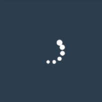
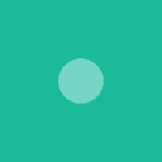

# VLoadingViews
Some nice loading views on Android imitate [SpinKit](https://github.com/tobiasahlin/SpinKit) (in development).

| Picture                                      | Name          | Attrs                                                        |
| -------------------------------------------- | ------------- | ------------------------------------------------------------ |
|  | VLoadingView0 | app:rectangle_width="50dp" app:rectangle_color="#ffffff" app:total_duration="12000" |
|  | VLoadingView1 | app:maximum_circle_radius="5dp" app:circle_color="#ffffff" |
|  | VLoadingView2 | app:circle_color="#99ffffff"//need alpha                     |
|  | VLoadingView3 | app:bar_color="#ffffff" app:bar_count="5" app:bar_spacing_size="3dp" |
|  | VLoadingView4 | app:max_rect_side_size="14dp" app:min_rect_side_size="7dp" app:rect_color="#ffffff" |
|  | VLoadingView5 | app:circle_color="#ffffff"                                   |
|  | VLoadingView6 | app:circle_color="#ffffff"                                   |
|  | VLoadingView7 | app:circle_color="#ffffff" app:circle_count="3" app:per_circle_spacing_size="5dp" |
|  | VLoadingView8 | app:anim_duration="800" app:circle_color="#ffffff" app:max_circle_radius="4dp" |

